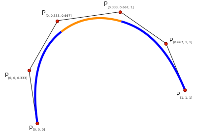
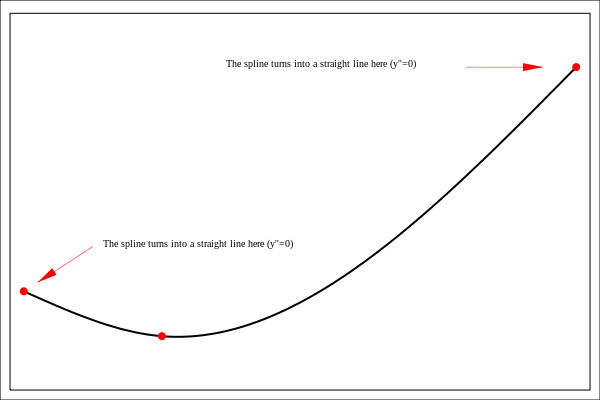

## What is a Spline?

* A continuous curve that passes through a set of points
* Piecewise function that is defined by a number of polynomials
* Can have polynomials of differing degrees
* Parametric curve and can be interpolated

## How Can Cubic Splines Splines Be Interpolated?

* In this project, I will specifically be using and talking about cubic splines
* Splines can be split into various subintervals
* For example, the interval [0,2] can be split up into [0,1] and [1,2]
* A cubic function can be calculated for that specific segment and parameterized from the domain [0,1]
* To ensure the curve is always continuous, the derivative and second derivative have to equal each other at the connection points between the subintervals
* The endpoints can the second derivatives it has to equal to defined previously, which is a clamped spline
* It could also have the second derivative equal to 0, which is a natural spline

## How Can Splines Be Utilized in the Context of Robotics?

We can first look at ways for robots to travel between between two points.  There are quite of few methods that exist for robots to travel between points.  A simple approach is to use a sequence of straight lines and turns that the robot travels on.  To go accurately to the points with the straight lines and turns, the robot can slow down as it reaches the desired end point using a PID controller (which was actually my project last year).  This is a viable approach in many cases for traveling to a point with a robot.

However, when a high speed is used with these traditional methods, the robot typically falters due to many limitations ranging from effeciency losses, the higher acceleration causing the wheels to slip, and outside forces like the force of friction.

A proposed solution to this problem would to create a motion profile for the robot based off of its physical constraints.  This ramps up and ramps down the speed of the robot; it makes the robot follow a trapezoidal profile which is pictured below.  

However, this is only some of the solution to the problem, and alone, it even exacerbates the issue that we were trying to solve in making the robot faster; this is because a full acceleration and deceleration cycle is needed for every movment of the robot.  A way to combat this problem is by introducing splines.  With splines, the movment of the robot of the turn and the translational movement can be combined in one manuever.  Also, the curve is smooth, which allows it to accelerate and decelerate without wasting time.  A spline movement is roughly 1.5 times faster than traditional approaches, so the benefits are clear. 

Also, for navigating on a spline, the robot has to know where it is on the field.  The robot can measure how many inches it travels using encoders, which are sensors mounted on a motor to determine how many times the shaft spins.  Using the kinematics of the robot and how the wheels move, a formula can be derived for calculated the robot x and y position.  For the heading

## The Calculations and Implementation with an Actual Robot
Here is an example calculation of interpolating a spline.  Here, we interpolate a cubic spline that passes through three points: (1, 4), (2, 1), and (3,4).  It is easiest to set the domain for each segment from [0,1] as the interpolation becomes much easier.  In this case, there will be 2 segments, one from [1,2] and another one from [2,3].  The value, the deriviative, and the second derivative have to equal between the connection points of the two segments, which ensures continuity and that the curve is smooth.  We can get a few equations from this process and use a matrix solver to find the values of the coefficients.

Now this example calculation is great, but for a robot with a motion profile, the spline should be parameterized for a function of time, instead of the x coordinate.  So, there will be two equations, one for the x position on the field and the other one for the y position.  So, I put an implementation into place in my Java code.

## Conclusion
Using splines for robot navigation is extremely worthwhile and increases the effenciency of the robot in completing tasks and manuevering around places.  When speed is key, splines are the way to go in robot movment.  However, having the robot follow splines perfectly is exceptionally tricky.  For the following to be accurate, there are other coeficcients regarding the physical constraints of the robot and also feedback variables which have to be tuned to work perfectly.  Tuning these can alone take up many hours to make it work great, so that is a challenge that I encountered.  The other hard part was implementing a trapezoidal motion profile for the robot and also position tracking of the robot at the same time.  Since all of those components had to work in order for the robot to follow the spline properly, it took more time to develop and complete the project.  

## Reflection
I found this project to be really exciting but also very challenging at the same time.  Learning about how splines were interpolated was a tough concept, but it made sense after reading more about it.  The harder part comes when I had to take the spline that was generated and then connect it to a motion profile of a robot and also tracking its position on an XY plane.  It was a nice endeavour to take on a calculus-based concept and integrate it with robotics and making it perform better.
